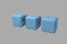
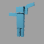

# M06–M08 completion evidence

**Passed:** M06 modeling/procedural prerequisite, M07 rendering breadth and M08
animation/rig/deformation, for the named experimental profiles in
[the implementation contract](../../docs/m07_m08.md). Canonical milestone
requirements and prior evidence were not relaxed or overwritten.

Run: `artifacts/m06-m08/run-20260906T001610Z`, macOS ARM64 and isolated Chromium.
Candidate branch: `feat/m07-m08-completion`, based on `de07c70` with the prior
uncommitted static PBR slice retained. This directory records local validation,
not a pushed commit or CI result.

- **87 native tests, 77 Wasm tests**, strict native/Wasm Clippy and formatting.
- **All 17 inherited gates passed**, including Linux/Windows compile checks,
  both ABI clients, native client, dependency audit and browser foundation.
- **Seven complete native workflows:** modeling, curves/points, groom, sparse
  media, advanced surfaces/displacement, imaging and nine-frame character sequence.
- Browser OPFS recovery, pinned revision rejection, immutable authoring and
  supported GPU cancellation/rendering passed.
- Ten new native/browser linear/depth/normal/object pass comparisons were identical
  for these deterministic fixtures, including five distinct shutter frames.
  Imaging display/albedo/bakes and coverage were also identical. This is measured
  fixture behavior, not a promise of bitwise identity on every future device.
- The inherited external textured PBR CPU/Metal/WebGPU workflow also passed.

## Evidence by gate

| Gate | Evidence |
|---|---|
| Complete acceptance | [Acceptance index](acceptance_index.json), [run report](validation_report.json), [foundation report](foundation/validation_report.json) |
| M06 operators | [Modeling conformance](modeling_conformance.json), [direct/group/field parity](procedural_conformance.json), [correspondence and edit growth](topology_mapping_report.json) |
| M07 geometry/media | [Family report](geometry_family_report.json), [browser report](browser_report.json) |
| M07 surfaces/imaging | [Feature conformance](render_feature_conformance.json), [independent color vectors](color_profile_vectors.json), [imaging comparison](imaging_cross_platform_report.json) |
| M08 character/rig | [Animation conformance](animation_conformance.json), [solver report](rig_solver_report.json) |
| M08 shutter sequence | [Motion blur report](motion_blur_report.json), [request](character-01/request.json), [native report](character-01/report.json) |
| Cross-platform images | [New profiles](cross_platform_report.json), [inherited static PBR](static_pbr_cross_platform_report.json) |
| Resources/provenance | [Measured resources](resource_measurements.json), [dependency/provenance delta](dependency_provenance.json), [runtime inventory](dependency_inventory.json) |
| Integration review | [Findings and resolutions](integration_review.md), [failed experiments](failed-experiments/README.md) |

Every `*-01` directory contains a canonical authored `document.json`, native
recovery journal, image/pass artifacts and workflow report. Browser reports include
OPFS recovery and receipts. The character directory contains all nine completed
frames and an explicitly loss-reported deformed OBJ export. Small PNG previews are
format conversions of native PPM artifacts, not reference-image replacements.




## Scope and costs

The seven new native fixture processes measured RSS from **18,153,472 to
47,038,464 bytes**. Their reports separately record elapsed time, source snapshot
bytes, evaluated geometry/media counts and derived bytes. Local edge splits and
wide arrays measure the current global connectivity rebuild at 1, 8 and 32 source
boxes. These small debug-build measurements do not establish scalability limits.
The inherited textured PBR process has a separate, much larger footprint, retained
in the resource report; it is not included in that new-fixture range.

Native CPU and browser Wasm share the computational implementation. Curves, points,
grooms, modeling outputs, supported displacement and evaluated animation geometry
also render on Metal/WebGPU. Sparse media, advanced BSDF/alpha, imaging and temporal
sequence accumulation use Rust CPU; incompatible GPU requests reject explicitly.
Linux/Windows validation is compile-only. The editor, external animated/volume
file adapters, physical fiber BSDF, general Boolean/bevel, indirect volume transport,
advanced rigs and broad Blender compatibility remain separate capability profiles.

The checked lockfile matches the previously audited static PBR slice; no additional
runtime dependency was introduced for M06–M08. Original synthetic fixture generation
is in `crates/core/src/feature_fixtures.rs`; external PBR inputs retain their checked
provenance manifests. Existing M05 and static PBR evidence remains historical.

## Reproduce

Start the local Rust server on 8765 and isolated Chrome CDP on 9223 as documented
in [agent_alpha.md](../../docs/agent_alpha.md), then run:

```sh
python3 scripts/validate-milestones.py
python3 scripts/summarize-milestones.py artifacts/m06-m08/run-<timestamp>
```

The first command writes a fresh run and never installs or updates golden images.
The second derives gate indexes from already passed native/Wasm logs and workflow
reports. `source_manifest.json` captures maintained inputs at validation completion;
`reviewed_source_manifest.json` records the final documentation/evidence review.
`source_integrity.json` verifies that all validated Rust inputs, tests and dependency
manifests remain unchanged during that finalization. The supplemental imaging
comparison is described in its JSON report; expected color vectors come from
independent W3C matrices, not regenerated image references.
