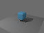

# General project CLI evidence

**Passed:** `project-cli-v0`, on branch `feat/general-project-cli`, based on
`d2b34a6`. This is a host-interface addition over the existing M00–M08 engine.
It does not complete M09 or expand format/backend compatibility.

The [contract and request fields](../../docs/project_cli.md) document:

```sh
target/debug/render-host project --help
target/debug/render-host project <project-directory> <request.json|->
```

## Validation

[All nine validation gates passed](validation_report.json): formatting, strict
workspace Clippy, **94 native tests**, Linux/Windows host compile, browser compile,
native build, dependency audit and the independent CPU/Metal CLI workflow.

The seven new tests comprise six external-process integration cases and one
controlled publication-boundary test. They cover ordinary API/CLI delta equality;
create/import/model/animate/evaluate/render/products/export/restore; import retries;
invalid fields and resources; stale revisions; existing output paths; byte and wall
limits; cancellation after a completed sequence frame; safe authored names; and
GPU profile rejection before device creation.

The [independent workflow](workflow/workflow_report.json) performs **36 one-shot
CLI requests**, recorded in `workflow/requests` and `workflow/responses`. It authors
and bevels an original box, imports a UV ground plane, adds animation/imaging,
evaluates random times, renders a shutter frame and five-frame sequence, bakes
normals, exports native/OBJ artifacts and restores the native archive in a new
process. It never calls demo commands or imports the engine as a library.

The source document digest remains unchanged across evaluation, rendering and
export. Native restore reproduces the full document digest. All artifact manifests
have independently checked byte counts and SHA-256 digests. Separate frame and
sequence midpoint PFM data are identical.

The depth-two CPU scene is explicitly rejected by the current GPU diffuse profile.
A separately restored project receives ordinary depth-one settings and renders on
both CPU and Metal: RGB RMSE **7.339668826118408e-9**, with **zero object-ID
mismatches**. No backend setting is changed implicitly.



The preview is a format conversion of the native PPM, not a reference-image update.

## Resources and provenance

The timed native subprocess records in the workflow report distinguish wall time,
maximum RSS and peak footprint:

| Operation | Wall time, seconds | Maximum RSS, bytes |
|---|---:|---:|
| Depth-two CPU scene | 0.335 | 19,382,272 |
| CPU shutter frame | 0.609 | 19,841,024 |
| Five-frame CPU sequence | 1.899 | 20,037,632 |
| Imaging products | 0.475 | 19,972,096 |
| Depth-one CPU reference | 0.284 | 19,513,344 |
| Depth-one Metal render | 0.449 | 35,733,504 |

These measurements include process launch/recovery on one macOS ARM64 machine,
using a debug build and small fixtures. They are not scalability or cross-platform
performance claims. Detailed raw `/usr/bin/time -l` output remains in the response
logs; artifact manifests separately account for encoded output bytes.

[Dependency/provenance](dependency_provenance.json) and the
[runtime inventory](dependency_inventory.json) confirm no new runtime dependencies.
[Shared source integrity](shared_source_integrity.json) proves computational,
browser, ABI and dependency sources unchanged from the validated M06–M08 base.
Its 77 Wasm runtime tests remain prior evidence; this change reran browser
compilation, not browser runtime tests. Linux/Windows checks are compile-only.

The original synthetic input corpus is pinned in
`fixtures/project-cli/provenance.json`. Existing external static PBR test fixtures
and attribution are byte-identical to the base commit. The CLI is a native
filesystem/process adapter over shared Rust semantics, without a privileged
mutation path or foreign computational runtime.

## Review and failed attempts

[Integration review](integration_review.md) records the publication and path
boundaries. `failed-experiments/` retains the first complete validation attempt:
all eight build/test/audit gates and the CPU workflow passed, then the Metal
comparison correctly rejected depth two. The corrected workflow explicitly tests
that rejection and selects a supported profile on a restored project. The engine
restriction and comparison tolerance were unchanged.

An earlier integration test found that serde unit variants could accept ignored
fields despite the enum annotation. Empty struct variants now reject those fields;
both inspect and document-export negative cases pass. This was a parser-boundary
fix, with no new schema version or ignored diagnostic.

## Reproduce

```sh
python3 scripts/validate-project-cli.py
```

This writes a fresh `artifacts/project-cli/run-*`, including the independent
workflow. Native Metal/resource access is required for the full validator. The
CPU-only workflow can also run with:

```sh
cargo build -p render-host --locked --offline
python3 scripts/project-cli-workflow.py artifacts/new-cli-run
```

Use a fresh output path; archived requests include their original absolute paths
and are provided for review, not blind replay. `source_manifest.json` records the
validation inputs; `reviewed_source_manifest.json` adds final documentation and
capability updates. `final_source_integrity.json` checks that tested Rust inputs
were unchanged during finalization. Historical milestone evidence is untouched.
